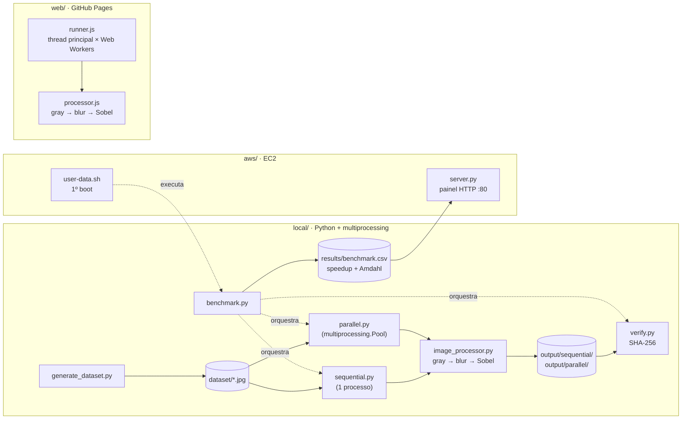

<h1 align="center">
  <picture>
    <source media="(prefers-color-scheme: dark)" srcset="assets/logo/logo-dark.png">
    
  </picture>
</h1>

<div align="center">
  
[](https://www.python.org/)
[](https://opencv.org/)
[](https://numpy.org/)
[](https://github.com/lianeheidemann/parallel-image-pipeline/actions/workflows/ci.yml)
[](https://github.com/lianeheidemann/parallel-image-pipeline/actions/workflows/pages.yml)

</div>

Usa multiprocessamento (`multiprocessing`) para **reduzir o tempo** de
processamento de um lote de imagens. O processamento é propositalmente simples —
conversão para escala de cinza, seguida de blur gaussiano e detecção de bordas
(Sobel) — para servir de carga padronizada: a mesma operação roda na versão
sequencial e na paralela, e a diferença de tempo mede o ganho (*speedup*),
comparado ao teto da Lei de Amdahl. As saídas são verificadas bit a bit. Inclui a
implantação em uma instância AWS EC2 e uma versão web.

🌐 **[Página do projeto](https://lianeheidemann.github.io/parallel-image-pipeline/)**

## Arquitetura



As versões sequencial e paralela usam o mesmo `image_processor.py` e diferem só na distribuição do trabalho.

## Estrutura

Uma pasta por forma de execução; cada uma tem um README próprio.

```
local/   Python + multiprocessing: pipeline, sequencial, paralelo, verificação e benchmark
web/     versão no navegador com Web Workers (publicada no GitHub Pages)
aws/     nuvem: preparação da instância EC2 (user-data.sh) e painel HTTP (server.py)
tests/   local/ e aws/ (pytest), web/ (node --test)
```

## Instalação

Requer Python 3.10+ (Windows)

```bash
python -m venv .venv
.venv\Scripts\activate
pip install -r requirements.txt
```

## Uso

```bash
python local/generate_dataset.py --count 2000 --width 1920 --height 1080
python local/sequential.py
python local/parallel.py --workers 4
python local/verify.py
python local/benchmark.py --workers 2 4 8 --repeat 3
python aws/server.py                     # painel em http://localhost:8080/
```

| Pasta | Conteúdo |
|---|---|
| `dataset/` | Entrada: arquivos `.jpg` (outra pasta: `--dataset CAMINHO`) |
| `output/sequential/`, `output/parallel/` | Um PNG de bordas por imagem; limpas a cada execução |
| `results/` | `sequential_report.csv`, `parallel_report_N.csv` (tempo por imagem e processo) e `benchmark.csv` |

Somente `.jpg` é lido; as pastas de dados são ignoradas pelo Git. O volume de
referência (2000 imagens 1920×1080) leva ≈ 3 min no sequencial e ocupa ≈ 11 GB.

## Implementação

- **Estratégia:** paralelismo de dados (uma imagem por tarefa) com processos, pois o
  trabalho é limitado por CPU e, no CPython, threads não somam núcleos (GIL).
  `Pool.map` com `chunksize=1` distribui as imagens dinamicamente.
- **Seção crítica:** o contador de concluídas (`multiprocessing.Value`) e o relatório
  CSV são escritos por todos os processos e protegidos por um `multiprocessing.Lock`
  que envolve apenas o incremento e a escrita da linha (`_process_one` em `local/parallel.py`).
- **Corretude:** `verify.py` exige saídas idênticas byte a byte (SHA-256).
- **Medição:** `benchmark.py` intercala `--repeat` rodadas e registra a mediana em
  `benchmark.csv` (`processos`, `tempo_s`, `speedup`, `speedup_amdahl_previsto`,
  `verificado`), com `p` estimado para `S = 1 / ((1 - p) + p / N)`.

## Implantação na AWS (EC2)

Detalhes em [`aws/`](aws/).


| Porta | Origem | Uso |
|---|---|---|
| 22/TCP | IP da equipe (`/32`) | Administração (SSH) |
| 80/TCP | `0.0.0.0/0` | Painel de resultados; aceita só `GET` e não dispara processamento |

A porta administrativa nunca fica aberta para `0.0.0.0/0`; se a rede de origem
mudar, a regra 22 é atualizada.

- **Criação (console, AWS Academy):** `us-east-1`, Ubuntu Server 24.04 LTS,
  `c5.large`, par `vockey`, 30 GiB gp3, grupo de segurança acima e
  `aws/user-data.sh` em *User data*. Alternativa: outra família sem créditos de
  CPU (ex.: `m5.large`); evitar t2/t3, que distorcem a medição.
- **Primeiro boot:** o script instala o projeto, registra o painel como serviço
  `systemd` (porta 80, usuário sem privilégios) e roda o benchmark de referência
  (log em `results/setup.log`).
- **Acesso:** `http://IP-PÚBLICO/` (painel) e `ssh -i labsuser.pem ubuntu@IP-PÚBLICO`.
  Com 2 vCPU, o benchmark mede 1 e 2 processos.

## Python local, GitHub Pages e AWS

As três formas executam o mesmo pipeline. A AWS roda o mesmo código Python da
versão local, numa instância EC2, com um painel de resultados na porta 80:

| Aspecto | Python local | GitHub Pages | AWS (EC2) |
|---|---|---|---|
| Onde roda | Seu computador | Navegador | Instância EC2 `c5.large` (Ubuntu 24.04) |
| Pasta | `local/` | `web/` | `aws/` (+ código de `local/`) |
| Como começa | Comandos no terminal | Abrir o link | `aws/user-data.sh` prepara tudo no 1º boot |
| Resultado | `results/` e terminal | Na própria página | Painel `aws/server.py` na porta 80 + `results/` |
| Linguagem | Python | JavaScript | Python |
| Executor | CPython | Navegador | CPython |
| Paralelismo | `multiprocessing` | Web Workers | `multiprocessing` |
| Pool | Sim (`multiprocessing.Pool`) | Não: fila própria em `web/assets/runner.js` | Sim |
| `chunksize=1` | Sim | Não literalmente: cada worker recebe uma faixa por vez | Sim |
| Tarefa | 1 imagem | 1 faixa da imagem | 1 imagem |
| GIL | Relevante | Não se aplica | Relevante |
| Vários núcleos | Processos podem aproveitar | Workers podem ser executados em paralelo | 2 vCPU: mede 1 e 2 processos |
| 1 imagem + 4 workers | Só 1 processo trabalha | A imagem é dividida em 4 faixas | Só 1 processo trabalha |
| Cinza + blur + Sobel | OpenCV | Implementados em JavaScript | OpenCV |

### Web Workers x multiprocessing x AWS

Nos dois casos o paralelismo é real: cada fluxo roda em um núcleo, com memória
própria, e a comunicação é por mensagens. A diferença está em como os fluxos são
criados e em como o resultado é juntado:

- **O que é cada fluxo:** `multiprocessing` cria **processos** do sistema
  operacional, cada um com seu próprio interpretador Python e seu próprio GIL. Um
  Web Worker é uma **thread** do motor JavaScript do navegador, isolada da página,
  sem GIL. Criar um worker é mais leve que criar um processo.
- **Como o trabalho chega:** o `Pool` serializa (pickle) o caminho de cada imagem e
  o envia por um pipe; o processo lê a imagem do disco. Na página, `postMessage`
  **transfere** o `ArrayBuffer` da faixa para o worker, sem copiar os bytes.
- **Estado compartilhado:** no Python, o contador (`mp.Value`) e o CSV são escritos
  por todos os processos, por isso ficam numa seção crítica com
  `multiprocessing.Lock`. Na página não há estado compartilhado: cada worker devolve
  a sua faixa e só a thread principal junta os resultados, uma mensagem por vez,
  então não há lock.
- **Quem distribui:** no Python, o `Pool` (`chunksize=1`). Na página, a fila de
  `runner.js`, que entrega a próxima faixa ao worker que terminou.

**E a AWS?** Não é uma terceira técnica: a EC2 executa o mesmo `multiprocessing` de
`local/`. Muda o ambiente, não o paralelismo. O que ela acrescenta é uma máquina
padronizada e registrada no painel (tipo e zona), sem outros programas disputando a
CPU, com o resultado acessível pela porta 80 e as regras de rede exigidas pela lauda
(grupo de segurança). Na leitura do resultado, a `c5.large` tem 2 vCPU que são
**1 núcleo físico com 2 threads** (hyperthreading): com 2 processos o speedup fica
bem abaixo de 2×, por efeito do hardware e não do código. Uma `c5.xlarge` (2 núcleos
físicos) mostraria mais ganho, se o Learner Lab liberar.

## Página web

`web/` roda o mesmo pipeline no navegador (thread principal × 2, 4 e 8 Web Workers,
em faixas horizontais), sem enviar nem salvar imagens. Os tempos não são comparáveis
aos do Python. Local: `npx http-server web`. Detalhes em [`web/`](web/).

## Testes

```bash
pip install -r requirements-dev.txt
pytest -q                          # Amdahl, verify.py, sequencial == paralelo, painel HTTP
node --test tests/web/*.test.mjs   # faixas == imagem inteira, versões de cache (?v=)
```

## Licença

Distribuído sob a licença [MIT](LICENSE).
