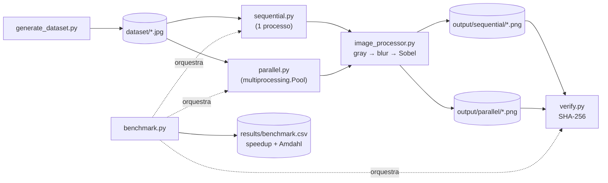

# Processamento Paralelo de Imagens

[](https://www.python.org/)
[](https://opencv.org/)
[](https://numpy.org/)
[](https://github.com/lianeheidemann/parallel-image-pipeline/actions/workflows/ci.yml)
[](https://github.com/lianeheidemann/parallel-image-pipeline/actions/workflows/pages.yml)

Comparação entre processamento **sequencial** e **paralelo** (`multiprocessing`)
de um mesmo pipeline de imagem — escala de cinza → blur gaussiano → detecção
de bordas (Sobel) — com verificação de corretude bit a bit e medição de
*speedup* frente à Lei de Amdahl.

🌐 **[Página do projeto](https://lianeheidemann.github.io/parallel-image-pipeline/)** 

## Estrutura

```
dataset/                  imagens de entrada
output/sequential/        saída da versão sequencial
output/parallel/          saída da versão paralela
results/                  relatórios CSV + benchmark.csv
src/
  common.py                caminhos padrão, relatório CSV e utilitários compartilhados
  image_processor.py       pipeline aplicado a uma imagem
  generate_dataset.py      gera um dataset sintético
  sequential.py            versão sequencial (1 processo)
  parallel.py              versão paralela (multiprocessing.Pool)
  verify.py                compara saídas via SHA-256
  benchmark.py             roda sequencial + paralelo e calcula o speedup
docs/                     página web (GitHub Pages)
  assets/app.js            seleção de imagens e botão "Processar"
  assets/runner.js         medição: sequencial, Web Workers e corte em faixas
  assets/render.js         desenho dos resultados (métricas, gráfico, imagens)
  assets/explain.js        explicações sobre a variação dos tempos
  assets/format.js         formatação de números (pt-BR)
  assets/processor.js      mesmo pipeline de image_processor.py, em JavaScript
  assets/worker.js         Web Worker que processa uma faixa
tests/                    testes (pytest + node --test)
```

## Arquitetura



`image_processor.py` concentra a lógica de transformação de uma única
imagem e é reutilizado tanto pela versão sequencial quanto pela paralela —
as duas diferem apenas em **como** distribuem o trabalho, nunca no
resultado. `common.py` centraliza o que é puramente infraestrutural
(caminhos padrão, listagem do dataset, escrita do relatório CSV), evitando
que cada script redefina o mesmo caminho ou formato de CSV. `benchmark.py`
não reimplementa nada: chama `sequential.run`, `parallel.run` e
`verify.verify` diretamente, garantindo que o número comparado é sempre o
mesmo que roda isoladamente.

## Instalação

```bash
python -m venv .venv
.venv\Scripts\activate          # Windows
source .venv/bin/activate       # Linux/macOS
pip install -r requirements.txt
```

## Uso

```bash
# 1. gerar dataset sintético
python src/generate_dataset.py --count 1000 --output dataset

# 2. executar versão sequencial
python src/sequential.py --dataset dataset --output output/sequential --report results/sequential_report.csv

# 3. executar versão paralela (padrão: todos os núcleos)
python src/parallel.py --dataset dataset --output output/parallel --report results/parallel_report.csv --workers 4

# 4. verificar que as saídas são idênticas
python src/verify.py --sequential output/sequential --parallel output/parallel

# 5. benchmark completo (sequencial + N processos, com verificação e Lei de Amdahl)
python src/benchmark.py --dataset dataset --workers 2 4 8 --repeat 3
```

O benchmark Python grava `results/benchmark.csv` com as colunas `processos`,
`tempo_s`, `speedup`, `speedup_amdahl_previsto` e `verificado`. Cada
configuração roda `--repeat` vezes (padrão 3), com as rodadas intercaladas, e o
CSV guarda a mediana. O comando termina com código 1 se alguma saída paralela
diferir da sequencial. As pastas `output/` são limpas a cada execução.

## Página web

A [página do projeto](https://lianeheidemann.github.io/parallel-image-pipeline/)
roda o mesmo pipeline em JavaScript, direto no navegador:

- compara o processamento **sequencial** (thread principal) com **2, 4 e 8
  Web Workers**; cada imagem é cortada em faixas horizontais, uma por worker;
- confere pixel a pixel que o resultado paralelo é igual ao sequencial;
- cada configuração roda 3 vezes, em rodadas intercaladas, e o gráfico mostra
  a mediana;
- aceita imagens **JPG, PNG ou WebP, sem limite de quantidade nem de tamanho**.
  O limite prático é a memória do navegador/aparelho; se uma imagem não puder
  ser carregada, a página diz qual foi.

Os tempos são medidos no navegador e não se comparam diretamente com o
benchmark Python (`multiprocessing`/OpenCV). Para rodar a página localmente
(módulos ES não abrem via `file://`):

```bash
npx http-server docs
```

## Testes

```bash
pip install -r requirements-dev.txt
pytest -q                               # Amdahl, verify.py, sequencial == paralelo
node --test tests/*.test.mjs            # versão web: faixas == imagem inteira, versões ?v= iguais
```

## Detalhes técnicos

**Estratégia.** Paralelismo de **dados**: o dataset é dividido em imagens
(`chunksize=1` no `Pool.map`), e cada worker aplica a mesma operação a uma
imagem por vez — não há divisão por etapas do pipeline. A distribuição usa
**processos** (`multiprocessing`), não threads: o trabalho é limitado por
CPU (OpenCV/NumPy) e, no CPython, threads não somam núcleos para esse tipo
de carga (GIL); cada processo tem seu próprio interpretador.

**Seção crítica.** Na versão paralela, os processos compartilham um contador
de progresso (`multiprocessing.Value`, em memória compartilhada) e o
relatório CSV — esse é o único estado compartilhado do programa. Ambos são
protegidos pelo mesmo `multiprocessing.Lock`, delimitando a menor seção
crítica possível — o processamento da imagem em si fica fora do lock:

```python
with _lock:
    _counter.value += 1
    with open(_report_path, "a", newline="", encoding="utf-8") as f:
        csv.writer(f).writerow([image_path.name, f"{elapsed:.4f}", process_label])
```

**Corretude.** `verify.py` calcula o SHA-256 de cada arquivo de saída e
confirma que sequencial e paralelo produzem exatamente os mesmos bytes.

**Speedup.** `Speedup = Tempo_sequencial / Tempo_paralelo`. A fração
paralelizável `p` é estimada a partir do speedup observado e usada na Lei de
Amdahl (`1 / ((1 - p) + p / N)`) para prever o speedup com outras contagens
de processos, permitindo comparar previsto vs. observado.

## Licença

Distribuído sob a licença [MIT](LICENSE).
