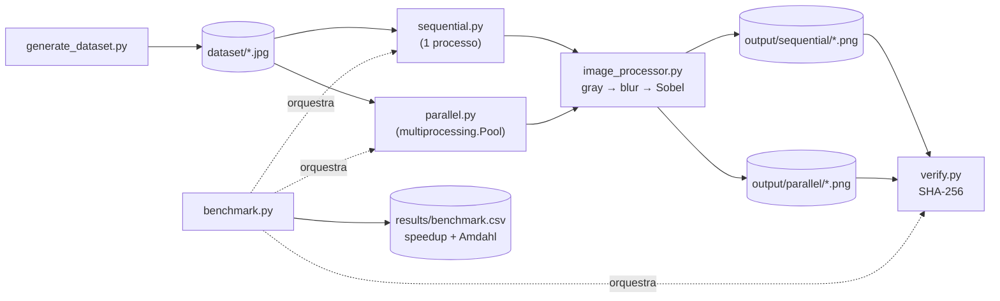

# Processamento Paralelo de Imagens

[](https://www.python.org/)
[](https://opencv.org/)
[](https://numpy.org/)
[](https://github.com/lianeheidemann/parallel-image-pipeline/actions/workflows/ci.yml)
[](https://github.com/lianeheidemann/parallel-image-pipeline/actions/workflows/pages.yml)

Comparação entre processamento **sequencial** e **paralelo** (`multiprocessing`)
de um mesmo pipeline de imagem — escala de cinza → blur gaussiano → detecção
de bordas (Sobel) — com verificação de corretude bit a bit e medição de
*speedup* frente à Lei de Amdahl.

🌐 **[Página do projeto](https://lianeheidemann.github.io/parallel-image-pipeline/)** 

## Python ou página web?

O projeto tem duas formas de rodar o mesmo pipeline:

| | Scripts Python (`src/`) | Página web (GitHub Pages) |
|---|---|---|
| Onde roda | No seu computador, por um terminal | No navegador, sem instalar nada |
| Imagens de entrada | Arquivos `.jpg` na pasta `dataset/` (ou outra, com `--dataset`) | As que você escolher na página |
| Resultados | Salvos em `output/` e `results/` | Só na tela; nada é salvo |
| Paralelismo | Processos (`multiprocessing`) + OpenCV | Web Workers + JavaScript |
| Para que serve | Medição do trabalho: tempos, speedup, Lei de Amdahl, verificação SHA-256 | Visualizar rapidamente o resultado com as suas imagens |

Para rodar com as suas imagens e guardar os resultados, use os **scripts Python**.
Não é preciso IDE: qualquer terminal serve (PowerShell, Terminal do macOS/Linux
ou o terminal integrado do VS Code/PyCharm).

## Estrutura

```
dataset/                  imagens de entrada
output/sequential/        saída da versão sequencial
output/parallel/          saída da versão paralela
results/                  relatórios CSV + benchmark.csv
src/
  common.py                caminhos padrão, relatório CSV e utilitários compartilhados
  image_processor.py       pipeline aplicado a uma imagem
  generate_dataset.py      gera um dataset sintético
  sequential.py            versão sequencial (1 processo)
  parallel.py              versão paralela (multiprocessing.Pool)
  verify.py                compara saídas via SHA-256
  benchmark.py             roda sequencial + paralelo e calcula o speedup
  server.py                painel de resultados (HTTP, só leitura) para a nuvem
cloud/
  user-data.sh             preparação da instância EC2 (campo "User data")
docs/                     página web (GitHub Pages)
tests/                    testes (pytest + node --test)
```

## Arquitetura



`image_processor.py` concentra a lógica de transformação de uma única
imagem e é reutilizado tanto pela versão sequencial quanto pela paralela —
as duas diferem apenas em **como** distribuem o trabalho, nunca no
resultado. `common.py` centraliza o que é puramente infraestrutural
(caminhos padrão, listagem do dataset, escrita do relatório CSV), evitando
que cada script redefina o mesmo caminho ou formato de CSV. `benchmark.py`
não reimplementa nada: chama `sequential.run`, `parallel.run` e
`verify.verify` diretamente, garantindo que o número comparado é sempre o
mesmo que roda isoladamente.

## Instalação

```bash
python -m venv .venv
.venv\Scripts\activate          # Windows
source .venv/bin/activate       # Linux/macOS
pip install -r requirements.txt
```

## Uso

```bash
# 1. gerar dataset sintético
python src/generate_dataset.py --count 1000 --output dataset

# 2. executar versão sequencial
python src/sequential.py --dataset dataset --output output/sequential --report results/sequential_report.csv

# 3. executar versão paralela (padrão: todos os núcleos)
python src/parallel.py --dataset dataset --output output/parallel --report results/parallel_report.csv --workers 4

# 4. verificar que as saídas são idênticas
python src/verify.py --sequential output/sequential --parallel output/parallel

# 5. benchmark completo (sequencial + N processos, com verificação e Lei de Amdahl)
python src/benchmark.py --dataset dataset --workers 2 4 8 --repeat 3
```

### Usar suas próprias imagens

1. Copie as imagens para a pasta `dataset/`. Só arquivos **`.jpg`** são lidos
   (`.png`, `.jpeg` e `.webp` são ignorados; no Linux/macOS, `.JPG` em
   maiúsculas também).
2. Rode os scripts pelo terminal, a partir da pasta do projeto:

```bash
python src/sequential.py
python src/parallel.py --workers 4
python src/verify.py
```

Para usar outra pasta sem copiar nada, passe `--dataset`:

```bash
python src/benchmark.py --dataset C:\Users\voce\Fotos --workers 2 4 --repeat 3
```

Para o volume registrado na ficha da Etapa 1 (sequencial levando minutos):

```bash
python src/generate_dataset.py --count 2000 --width 1920 --height 1080   # ≈ 3,6 GB
python src/benchmark.py --workers 2 4 8 --repeat 3                        # ≈ 3 min por rodada sequencial
```

Contando entrada e as duas saídas, isso ocupa cerca de 11 GB de disco.

O benchmark Python grava `results/benchmark.csv` com as colunas `processos`,
`tempo_s`, `speedup`, `speedup_amdahl_previsto` e `verificado`. Cada
configuração roda `--repeat` vezes (padrão 3), com as rodadas intercaladas, e o
CSV guarda a mediana. O comando termina com código 1 se alguma saída paralela
diferir da sequencial. As pastas `output/` são limpas a cada execução.

## Onde ficam os arquivos

Tudo fica **no seu computador**, dentro da pasta do projeto:

| Pasta | O que guarda |
|---|---|
| `dataset/` | Imagens de entrada (`.jpg`), suas ou geradas por `generate_dataset.py` |
| `output/sequential/` | Uma imagem de bordas (`.png`) por entrada, gerada pela versão sequencial |
| `output/parallel/` | O mesmo, gerado pela versão paralela (idêntico byte a byte) |
| `results/` | `sequential_report.csv` e `parallel_report_N.csv` (tempo de cada imagem e processo que a tratou) e `benchmark.csv` (resumo) |

- Cada execução **apaga os `.png` antigos** da pasta de saída antes de começar;
  copie para outro lugar o que quiser guardar.
- Essas pastas estão no `.gitignore`: as imagens e os relatórios **não vão
  para o GitHub** num `git push`.

## Página web

A [página do projeto](https://lianeheidemann.github.io/parallel-image-pipeline/)
roda o mesmo pipeline em JavaScript, direto no navegador:

- compara o processamento **sequencial** (thread principal) com **2, 4 e 8
  Web Workers**; cada imagem é cortada em faixas horizontais, uma por worker;
- confere pixel a pixel que o resultado paralelo é igual ao sequencial;
- cada configuração roda 3 vezes, em rodadas intercaladas, e o gráfico mostra
  a mediana;
- aceita imagens **JPG, PNG ou WebP, sem limite de quantidade nem de tamanho**.
  O limite prático é a memória do navegador/aparelho; se uma imagem não puder
  ser carregada, a página diz qual foi.

As imagens **não são enviadas para nenhum servidor e não são salvas**: ficam só
na memória da aba e somem ao recarregar ou fechar a página. A página também não
lê a pasta `dataset/` nem grava em `output/`. Para guardar uma imagem de bordas,
clique com o botão direito em "Bordas detectadas" e escolha "Salvar imagem como…".

Os tempos são medidos no navegador e não se comparam diretamente com o
benchmark Python (`multiprocessing`/OpenCV). Para rodar a página localmente
(módulos ES não abrem via `file://`):

```bash
npx http-server docs
```

## Execução na nuvem (AWS Academy)

A lauda pede a execução numa instância criada pela equipe, com um grupo de
segurança que libera a porta administrativa só para a equipe e abre apenas a
porta do serviço. Neste projeto:

```
Seu computador ──SSH 22 (só o seu IP/32)──► EC2 Ubuntu 24.04 · c5.large (2 vCPU) · EBS 30 GiB
Navegador     ──HTTP 80 (qualquer origem)─► painel de resultados (src/server.py, só leitura)
```

- **Serviço (porta 80):** `src/server.py`, um painel HTTP somente leitura com o
  último benchmark da instância (tempos, speedup, Amdahl, verificação, tipo de
  instância, zona e núcleos). Só responde `GET` em `/` e `/benchmark.csv`; não
  dispara processamento. Para testar localmente: `python src/server.py`
  (abre em `http://localhost:8080/`).
- **Preparação:** `cloud/user-data.sh`, colado no campo *User data* ao criar a
  instância. No primeiro boot ele instala o Python, baixa este repositório em
  `/home/ubuntu/parallel-image-pipeline`, sobe o painel como serviço `systemd`
  (volta sozinho quando a instância é religada), gera as 2000 imagens Full HD e
  roda o benchmark. Os parâmetros ficam no topo do script.

### Passo a passo no console

1. No AWS Academy, abra o **Learner Lab**, clique em *Start Lab* e, quando o
   indicador ficar verde, em *AWS*. Confira a região **us-east-1** (N. Virginia).
2. **EC2 → Launch instance**:
   - *Name*: `pipeline-imagens`
   - *AMI*: **Ubuntu Server 24.04 LTS**
   - *Instance type*: **c5.large** (2 vCPU, otimizada para computação). Se não
     estiver liberada no Learner Lab, use **t3.large** e anote no relatório.
   - *Key pair*: **vockey** (baixe `labsuser.pem` em *AWS Details* no Learner Lab)
   - *Network settings → Edit → Create security group*, nome `pipeline-sg`,
     com **exatamente estas duas regras de entrada**:

     | Tipo | Porta | Origem | Para quê |
     |---|---|---|---|
     | SSH | 22 | **My IP** (`x.x.x.x/32`) | administração (porta administrativa) |
     | HTTP | 80 | Anywhere (`0.0.0.0/0`) | painel de resultados (porta do serviço) |

   - *Configure storage*: **30 GiB gp3** (entrada + saídas ≈ 11 GB)
   - *Advanced details → User data*: cole o conteúdo de `cloud/user-data.sh`
3. *Launch instance*. Em alguns minutos, abra `http://IP-PÚBLICO/` (o IP aparece
   nos detalhes da instância): o painel mostra "Benchmark em andamento" e, ao
   terminar, a tabela. Com 2000 imagens Full HD em 2 vCPU, conte com cerca de
   meia hora (3 rodadas do sequencial e do paralelo).
4. Para entrar na instância:

   ```bash
   ssh -i labsuser.pem ubuntu@IP-PÚBLICO
   tail -f ~/parallel-image-pipeline/results/setup.log
   ```

**Por que a porta 22 não fica aberta para `0.0.0.0/0`:** é a porta de
administração. Aberta para qualquer origem, ela recebe varreduras e tentativas
de login da internet inteira; a lauda considera isso falha de projeto e zera o
critério. **No dia da apresentação, edite a regra 22 para "My IP" de novo**,
porque o IP da rede da sala é outro. A porta 80 pode ficar aberta: o painel só
mostra resultados e não aceita comandos.

### Na apresentação

- **Console, ao vivo:** a instância (estado, tipo, zona), a aba *Security* com
  as duas regras e a origem de cada uma, e o disco.
- **Execução, ao vivo:** pelo SSH, rode um volume menor para caber nos 3 minutos,
  enquanto o painel mostra a medição completa de 2000 imagens feita antes:

  ```bash
  cd ~/parallel-image-pipeline && source .venv/bin/activate
  python src/generate_dataset.py --count 300 --width 1920 --height 1080 --output /tmp/demo
  python src/benchmark.py --dataset /tmp/demo --results /tmp/demo-results --workers 2 --repeat 1
  ```

- Com 2 vCPU, o benchmark mede 1 e 2 processos (4 e 8 são ignorados com aviso),
  e o teto da Lei de Amdahl fica abaixo de 2.

### Custos e sessão

O Learner Lab encerra a sessão depois de 4 horas e **para** a instância (o disco
e os resultados continuam). Ao religar, o IP público muda e o painel volta
sozinho. Pare a instância (*Instance state → Stop*) quando não estiver usando;
apague (*Terminate*) quando a disciplina acabar.

## Testes

```bash
pip install -r requirements-dev.txt
pytest -q                               # Amdahl, verify.py, sequencial == paralelo
node --test tests/*.test.mjs            # versão web: faixas == imagem inteira, versões ?v= iguais
```

## Detalhes técnicos

**Estratégia.** Paralelismo de **dados**: o dataset é dividido em imagens
(`chunksize=1` no `Pool.map`), e cada worker aplica a mesma operação a uma
imagem por vez — não há divisão por etapas do pipeline. A distribuição usa
**processos** (`multiprocessing`), não threads: o trabalho é limitado por
CPU (OpenCV/NumPy) e, no CPython, threads não somam núcleos para esse tipo
de carga (GIL); cada processo tem seu próprio interpretador.

**Seção crítica.** Na versão paralela, os processos compartilham um contador
de progresso (`multiprocessing.Value`, em memória compartilhada) e o
relatório CSV — esse é o único estado compartilhado do programa. Ambos são
protegidos pelo mesmo `multiprocessing.Lock`, delimitando a menor seção
crítica possível — o processamento da imagem em si fica fora do lock:

```python
with _lock:
    _counter.value += 1
    with open(_report_path, "a", newline="", encoding="utf-8") as f:
        csv.writer(f).writerow([image_path.name, f"{elapsed:.4f}", process_label])
```

**Corretude.** `verify.py` calcula o SHA-256 de cada arquivo de saída e
confirma que sequencial e paralelo produzem exatamente os mesmos bytes.

**Speedup.** `Speedup = Tempo_sequencial / Tempo_paralelo`. A fração
paralelizável `p` é estimada a partir do speedup observado e usada na Lei de
Amdahl (`1 / ((1 - p) + p / N)`) para prever o speedup com outras contagens
de processos, permitindo comparar previsto vs. observado.

## Licença

Distribuído sob a licença [MIT](LICENSE).
