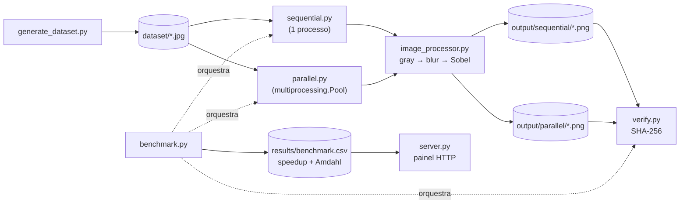

# Processamento Paralelo de Imagens

[](https://www.python.org/)
[](https://opencv.org/)
[](https://numpy.org/)
[](https://github.com/lianeheidemann/parallel-image-pipeline/actions/workflows/ci.yml)
[](https://github.com/lianeheidemann/parallel-image-pipeline/actions/workflows/pages.yml)

Comparação entre processamento **sequencial** e **paralelo** (`multiprocessing`)
de um mesmo pipeline de imagem — escala de cinza → blur gaussiano → detecção de
bordas (Sobel) — com verificação de corretude bit a bit e medição de *speedup*
frente à Lei de Amdahl. Inclui a implantação em uma instância AWS EC2 e uma
versão em JavaScript que roda no navegador.

🌐 **[Página do projeto](https://lianeheidemann.github.io/parallel-image-pipeline/)**

## Arquitetura



As versões sequencial e paralela usam o mesmo `image_processor.py` e diferem
apenas na distribuição do trabalho. `benchmark.py` chama os mesmos `run()` que
rodam isoladamente, de modo que o tempo comparado é sempre o do código real.

## Estrutura

```
src/
  common.py             caminhos padrão, relatório CSV e utilitários
  image_processor.py    pipeline aplicado a uma imagem
  generate_dataset.py   dataset sintético (semente fixa)
  sequential.py         versão sequencial
  parallel.py           versão paralela (multiprocessing.Pool + Lock)
  verify.py             comparação das saídas por SHA-256
  benchmark.py          rodadas intercaladas, speedup e Lei de Amdahl
  server.py             painel de resultados (HTTP, somente leitura)
cloud/user-data.sh      preparação da instância EC2
docs/                   versão web (GitHub Pages)
tests/                  pytest e node --test
```

## Instalação

Requer Python 3.10+.

```bash
python -m venv .venv
.venv\Scripts\activate          # Windows
source .venv/bin/activate       # Linux/macOS
pip install -r requirements.txt
```

## Uso

```bash
python src/generate_dataset.py --count 2000 --width 1920 --height 1080
python src/sequential.py
python src/parallel.py --workers 4
python src/verify.py
python src/benchmark.py --workers 2 4 8 --repeat 3
python src/server.py                     # painel em http://localhost:8080/
```

| Pasta | Conteúdo |
|---|---|
| `dataset/` | Entrada: arquivos `.jpg` (outra pasta: `--dataset CAMINHO`) |
| `output/sequential/`, `output/parallel/` | Um PNG de bordas por imagem; limpas a cada execução |
| `results/` | `sequential_report.csv`, `parallel_report_N.csv` (tempo por imagem e processo) e `benchmark.csv` |

Somente arquivos `.jpg` são lidos. As pastas de dados são ignoradas pelo Git.
O volume de referência (2000 imagens 1920×1080, ≈ 3,6 GB) leva cerca de 3 min
na versão sequencial e ocupa ≈ 11 GB com as saídas.

## Implementação

- **Estratégia:** paralelismo de dados; a unidade de trabalho é uma imagem.
  Processos em vez de threads, porque o trabalho é limitado por CPU e, no
  CPython, threads compartilham o GIL.
- **Distribuição:** `Pool.map` com `chunksize=1`; cada processo recebe a próxima
  imagem livre, o que balanceia a carga automaticamente.
- **Seção crítica:** o contador de progresso (`multiprocessing.Value`) e o
  relatório CSV são escritos por todos os processos e protegidos por um
  `multiprocessing.Lock`. Só o incremento e a escrita da linha ficam no lock:

  ```python
  with _lock:
      _counter.value += 1
      with open(_report_path, "a", newline="", encoding="utf-8") as f:
          csv.writer(f).writerow([image_path.name, f"{elapsed:.4f}", process_label])
  ```

- **Corretude:** `verify.py` compara o SHA-256 de cada PNG; sequencial e paralelo
  devem ser idênticos byte a byte. O benchmark termina com código 1 se divergirem.
- **Medição:** `benchmark.py` intercala as configurações em `--repeat` rodadas e
  registra a mediana. `benchmark.csv` traz `processos`, `tempo_s`, `speedup`,
  `speedup_amdahl_previsto` e `verificado`; a fração paralelizável `p` é estimada
  pela primeira contagem de processos e aplicada em `S = 1 / ((1 - p) + p / N)`.

## Implantação na AWS (EC2)

```
Equipe    ──SSH 22 (IP da equipe /32)──► EC2 Ubuntu 24.04 · c5.large (2 vCPU) · EBS 30 GiB gp3
Navegador ──HTTP 80 (0.0.0.0/0)────────► server.py (somente leitura)
```

| Porta | Origem | Uso |
|---|---|---|
| 22/TCP | IP da equipe (`/32`) | Administração (SSH) |
| 80/TCP | `0.0.0.0/0` | Painel de resultados; aceita só `GET` e não dispara processamento |

A porta administrativa nunca é aberta para `0.0.0.0/0`; quando a rede de origem
muda, a regra 22 é atualizada para o novo IP.

**Criação (console, AWS Academy Learner Lab):** região `us-east-1`, AMI Ubuntu
Server 24.04 LTS, tipo `c5.large` (ou `t3.large`, se o primeiro não estiver
disponível), par de chaves `vockey`, disco de 30 GiB gp3, grupo de segurança com
as regras acima e o conteúdo de `cloud/user-data.sh` em *Advanced details → User
data*. No primeiro boot o script:

1. instala o projeto em `/home/ubuntu/parallel-image-pipeline`;
2. registra o painel como serviço `systemd` na porta 80, executado como usuário
   sem privilégios (`CAP_NET_BIND_SERVICE`) e reiniciado a cada boot;
3. gera o dataset de referência e executa o benchmark, registrando em
   `results/setup.log`.

**Acesso:** `http://IP-PÚBLICO/` para o painel; `ssh -i labsuser.pem
ubuntu@IP-PÚBLICO` para administração. Com 2 vCPU, o benchmark mede 1 e 2
processos. Pare a instância quando não estiver em uso; o IP público muda ao religá-la.

## Página web

`docs/` contém o mesmo pipeline em JavaScript. O processamento sequencial roda
na thread principal e o paralelo em 2, 4 e 8 Web Workers, com cada imagem
dividida em faixas horizontais; o resultado é conferido pixel a pixel. Aceita
JPG, PNG e WebP sem limite de quantidade ou tamanho. As imagens não saem do
navegador e nada é salvo. Os tempos não são comparáveis aos do benchmark Python.
Execução local: `npx http-server docs`.

## Testes

```bash
pip install -r requirements-dev.txt
pytest -q                       # Amdahl, verify.py, sequencial == paralelo, painel HTTP
node --test tests/*.test.mjs    # faixas == imagem inteira, versões de cache (?v=)
```

## Licença

Distribuído sob a licença [MIT](LICENSE).
