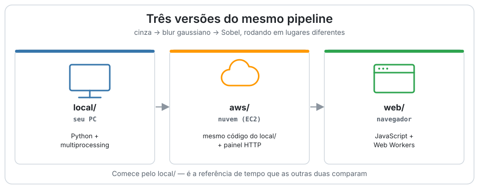

# Como rodar os 3 códigos

<p align="center">
  <picture>
    <source media="(prefers-color-scheme: dark)" srcset="../assets/diagramas/three-codes-dark.svg">
    <source media="(prefers-color-scheme: light)" srcset="../assets/diagramas/three-codes-light.svg">
    
  </picture>
</p>

O projeto tem três versões independentes do mesmo pipeline (cinza → blur → Sobel):
**[`local/`](../local/)** (Python no seu PC), **[`aws/`](../aws/)** (o mesmo código do
`local/` rodando numa instância EC2) e **[`web/`](../web/)** (JavaScript no navegador).

Comece por `local/`: é a referência de tempo sequencial e a base que a versão AWS
reaproveita.

## 0. Pré-requisitos (uma vez só)

No terminal do VS Code, na raiz do repositório:

```bash
python -m venv .venv
.venv\Scripts\activate        # Windows (PowerShell ou cmd)
# source .venv/Scripts/activate   # se estiver usando o terminal Git Bash
pip install -r requirements.txt
```

Confirme que o terminal do VS Code está usando o interpretador do `.venv`
(canto inferior direito, ou `Ctrl+Shift+P` → *Python: Select Interpreter*).

## 1. `local/` — roda no seu PC

Gera o dataset sintético (mesma semente sempre, então sequencial e paralelo usam
sempre a mesma entrada):

```bash
python local/generate_dataset.py --count 2000 --width 1920 --height 1080
```

> `--count 2000 --width 1920 --height 1080` é o volume de referência (faz o
> sequencial levar minutos, exigido pela ficha). Para testar rápido, use um
> `--count` bem menor primeiro, ex. `--count 50`.

Rode cada etapa separada (útil para mostrar cada peça na apresentação):

```bash
python local/sequential.py                 # 1 processo, gera output/sequential/
python local/parallel.py --workers 4        # Pool de 4 processos, gera output/parallel/
python local/verify.py                      # compara as duas saídas por SHA-256
```

Ou o experimento completo de uma vez (sequencial + várias contagens de processos,
com verificação e Lei de Amdahl):

```bash
python local/benchmark.py --workers 2 4 8 --repeat 3
```

Saída: `results/benchmark.csv` (tempo mediano, speedup, Amdahl previsto) e os
relatórios individuais em `results/*.csv`.

## 2. `aws/` — a mesma coisa, na nuvem

`aws/` não é um algoritmo diferente: é o código de `local/` rodando numa instância
EC2, com um painel HTTP somente leitura por cima.

- **Provisionar a instância** é feito no console da AWS (fora do VS Code): criar
  uma EC2 `c5.large`, Ubuntu 24.04, região `us-east-1`, e colar
  [`aws/user-data.sh`](../aws/user-data.sh) em *User data* — ele instala o projeto,
  gera o dataset, roda o benchmark e registra o painel no `systemd` no primeiro boot.
- **Regras de acesso:** porta 22 (SSH) só para o IP da equipe; porta 80 (painel)
  aberta para todo mundo, porque só faz leitura.
- **Acompanhar o setup**, depois de a instância subir:

  ```bash
  ssh -i labsuser.pem ubuntu@IP-PUBLICO
  tail -f ~/parallel-image-pipeline/results/setup.log
  ```

- **Testar o painel localmente antes de subir para a EC2** (roda no seu PC, sem
  AWS nenhuma, útil para depurar `aws/server.py`):

  ```bash
  python aws/server.py --port 8080
  ```

  Abra `http://localhost:8080/` no navegador. Fora da AWS, o campo de tipo de
  instância/zona fica vazio (a metadata só existe dentro da EC2).

## 3. `web/` — navegador, sem instalar nada

Mesmo pipeline reescrito em JavaScript, rodando 100% no navegador (nenhuma imagem
é enviada ou salva). Já está publicado no GitHub Pages:

🔗 https://lianeheidemann.github.io/parallel-image-pipeline/

Para rodar localmente a partir do VS Code:

```bash
npx http-server web
```

e abrir o endereço que o comando imprimir (por padrão `http://localhost:8080`).

Depois de processar, o botão **Baixar CSV** salva os tempos no mesmo formato de
`results/benchmark.csv` (arquivo `benchmark-web.csv`).

## 4. Comparar os ambientes (tabela + gráficos)

Tempos só são comparáveis se todos os ambientes processarem **o mesmo dataset**.
O padrão da comparação é **100 imagens de 1920×1080**, na pasta
`dataset-comparacao/`. O gerador usa semente fixa por imagem, então essas imagens
são idênticas no PC, no GitHub e na AWS. Cada CSV registra quantas imagens e qual
resolução usou, e o relatório avisa se algum ambiente usou outro dataset.

> **Antes de medir no notebook:** ligue o carregador e coloque *Configurações →
> Sistema → Energia → Modo de energia* em **Melhor desempenho**. Na bateria, o
> Windows reduz a frequência e joga o processo sequencial para os núcleos de
> eficiência: o sequencial fica lento, o paralelo parece "superlinear" e os números
> não valem.

Tudo da comparação fica em `results/comparacao/`:

```bash
# 1. dataset padrão (uma vez só)
python local/generate_dataset.py --count 100 --width 1920 --height 1080 --output dataset-comparacao

# 2. Python no PC  -> results/comparacao/benchmark.csv
python local/benchmark.py --dataset dataset-comparacao --results results/comparacao --workers 2 4 8 --repeat 3

# 3. web no PC (navegador headless) -> results/comparacao/benchmark-web.csv
npm install
npx playwright install chromium
node tools/web-benchmark.mjs --dataset dataset-comparacao --out results/comparacao/benchmark-web.csv

# 4. relatório e gráficos
python local/compare_environments.py
```

Não rode os passos 2 e 3 ao mesmo tempo: os dois disputam a CPU e um distorce o
tempo do outro. Em vez do passo 3, dá para abrir a página, selecionar as imagens de
`dataset-comparacao/`, clicar em **Baixar CSV** e salvar como
`results/comparacao/benchmark-web.csv`.

Outros ambientes entram pelo nome do arquivo, na mesma pasta:

| Ambiente | Como obter | Arquivo em `results/comparacao/` |
|---|---|---|
| local (PC) | passo 2 acima | `benchmark.csv` |
| aws (EC2) | `curl http://IP-PUBLICO/benchmark.csv -o results/comparacao/benchmark-aws.csv` | `benchmark-aws.csv` |
| actions (GitHub) | artefato do workflow da seção 5 | `benchmark-actions.csv` |
| web (navegador) | passo 3 acima ou botão **Baixar CSV** | `benchmark-web.csv` |

Saída, em `results/comparacao/`:
- `comparacao.md`: datasets, tabela, resumo e os gráficos;
- `graficos/tempo.svg`: tempo por número de processos (escala única quando o dataset é o mesmo);
- `graficos/speedup.svg`: speedup medido × ideal × previsto por Amdahl;
- `comparison.csv`: tudo junto, com a coluna `ambiente`.

Ambiente sem arquivo é pulado com um aviso. Para outra pasta: `--dir`; para
caminhos avulsos: `--local`, `--aws`, `--actions`, `--web`, `--out`.

> A AWS usa `aws/user-data.sh`, que gera 2000 imagens (o volume da ficha). Para
> comparar com os outros, rode lá também os passos 1 e 2 via SSH e baixe o
> `results/comparacao/benchmark.csv` da instância como `benchmark-aws.csv`.

## 5. Rodar no GitHub (Python e web na mesma máquina)

O workflow [`benchmark.yml`](../.github/workflows/benchmark.yml) gera o mesmo
dataset padrão numa máquina do GitHub Actions (4 núcleos) e mede o Python e a web
(Chromium headless) nela. É um ambiente remoto enquanto a AWS não está configurada.

1. No GitHub: aba **Actions** → **Benchmark (Python e web no GitHub)** → **Run
   workflow** (ou `gh workflow run benchmark.yml`).
2. No fim, o resumo da execução mostra a tabela; o artefato **benchmark-github**
   traz `comparacao.md`, `graficos/` e os CSVs.
3. Para ver só o GitHub: salve o artefato em `results/comparacao-github/` e rode
   `python local/compare_environments.py --dir results/comparacao-github`.
4. Para juntar com o PC: copie o `benchmark-actions.csv` para `results/comparacao/`
   e rode `python local/compare_environments.py`.

A máquina do GitHub é compartilhada: os tempos oscilam um pouco entre execuções.

## Ordem sugerida para a apresentação

1. `local/benchmark.py` rodando ao vivo — mostra sequencial vs. paralelo na mesma
   máquina, o tempo caindo e o speedup.
2. Painel da AWS aberto no navegador (`http://IP-PUBLICO/`) — prova de que o mesmo
   experimento também roda na nuvem.
3. Demo do `web/` (GitHub Pages) como comparação extra — deixe claro que os tempos
   do navegador **não** são comparáveis aos do Python (motor de imagem e
   granularidade de tarefa diferentes, ver [README](../README.md#ambientes-de-execução)).

## Problemas comuns

| Sintoma | Causa provável | Solução |
|---|---|---|
| `python` não encontrado | venv não ativado | rode `.venv\Scripts\activate` de novo |
| `ModuleNotFoundError: cv2` / `numpy` / `PIL` | dependências não instaladas nesse venv | `pip install -r requirements.txt` |
| `verify.py` acusa divergência | saída de uma execução anterior com outro dataset | apague `output/sequential` e `output/parallel` e rode de novo |
| `local/benchmark.py` muito lento | `--count` alto de mais para teste rápido | rode primeiro com `--count 50` |
| painel da AWS não mostra dados | `setup.log` ainda rodando o benchmark | espere terminar (`tail -f`) ou olhe o marcador `results/setup.running` |
| `compare_environments.py` diz "pulando" | o CSV daquele ambiente não está em `results/comparacao/` com o nome esperado | confira a tabela da seção 4 ou passe o caminho com `--aws`/`--web` |
| relatório avisa "datasets diferentes" | algum ambiente rodou com outro dataset | rode todos com `dataset-comparacao/` (seção 4) |
| paralelo "superlinear" ou tempos que mudam muito entre rodadas | notebook na bateria ou em modo de economia | ligue o carregador e use o modo "Melhor desempenho" |
