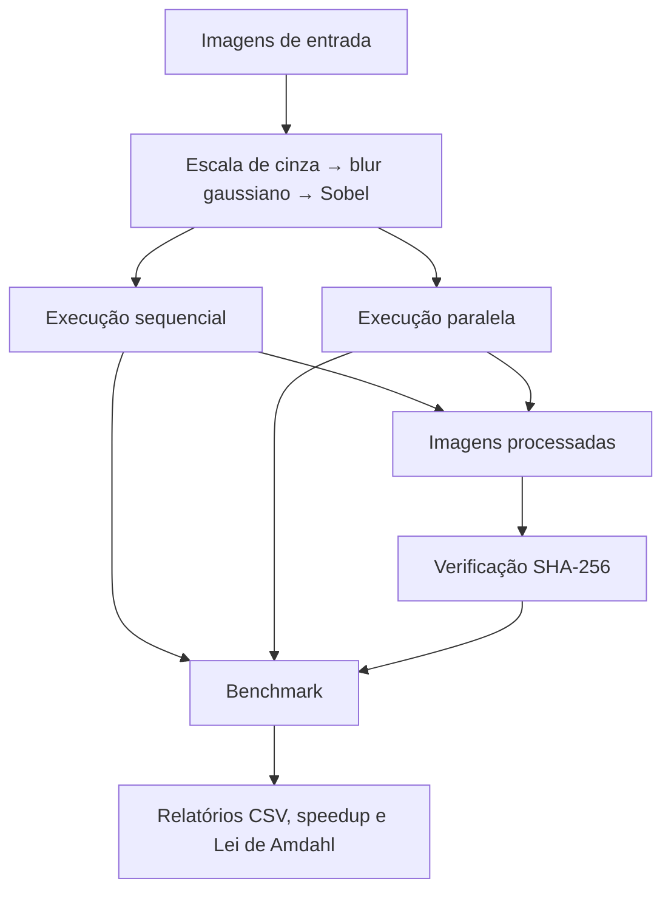

<h1 align="center">
  <picture>
    <source media="(prefers-color-scheme: dark)" srcset="assets/logo/logo-dark.png">
    
  </picture>
</h1>

<div align="center">

Pipeline para comparar processamento sequencial e paralelo de imagens no computador local, no navegador e na AWS.

[](https://www.python.org/)
[](https://opencv.org/)
[](https://numpy.org/)
[](https://github.com/lianeheidemann/parallel-image-pipeline/actions/workflows/ci.yml)
[](https://github.com/lianeheidemann/parallel-image-pipeline/actions/workflows/pages.yml)

[**Acessar demonstração web**](https://lianeheidemann.github.io/parallel-image-pipeline/)

</div>

## Sobre o projeto

O projeto aplica o mesmo pipeline de processamento a um conjunto de imagens:

1. conversão para escala de cinza;
2. aplicação de blur gaussiano;
3. detecção de bordas com Sobel.

A carga é executada de forma sequencial e paralela para medir a redução no tempo de processamento. O benchmark calcula o *speedup*, compara o resultado com o limite previsto pela Lei de Amdahl e verifica, por SHA-256, se as duas execuções produziram arquivos idênticos.

O repositório reúne três ambientes de execução:

- **Python local:** usa processos com `multiprocessing.Pool`;
- **GitHub Pages:** processa a imagem no navegador com Web Workers;
- **AWS EC2:** executa o mesmo código Python local em uma máquina virtual padronizada e disponibiliza os resultados em um painel HTTP.

## Arquitetura



Nas versões local e AWS, as execuções sequencial e paralela compartilham o mesmo `local/image_processor.py`. Assim, a principal diferença entre elas é a forma como as imagens são distribuídas para processamento.

## Principais recursos

- processamento sequencial e paralelo de lotes de imagens;
- uso de múltiplos núcleos da CPU com `multiprocessing`;
- configuração da quantidade de processos (*workers*);
- medição de tempo por imagem e por execução;
- cálculo de *speedup* e estimativa baseada na Lei de Amdahl;
- validação das saídas com hash SHA-256;
- demonstração interativa com Web Workers;
- implantação automatizada em uma instância AWS EC2;
- testes automatizados para Python, painel AWS e versão web;
- integração contínua com GitHub Actions.

## Estrutura do repositório

```text
parallel-image-pipeline/
├── .github/workflows/     # Integração contínua e publicação no GitHub Pages
├── assets/logo/           # Logos usadas na documentação
├── aws/                   # Painel HTTP e configuração da instância EC2
├── dataset/               # Imagens JPG de entrada
├── local/                 # Pipeline, benchmark e verificação em Python
├── output/
│   ├── parallel/          # Saídas da execução paralela
│   └── sequential/        # Saídas da execução sequencial
├── results/               # Relatórios CSV gerados
├── tests/                 # Testes das versões local, web e AWS
├── web/                   # Interface publicada no GitHub Pages
├── requirements.txt
└── requirements-dev.txt
```

Cada ambiente possui documentação complementar:

- [Execução local](local/)
- [Versão web](web/)
- [Implantação na AWS](aws/)

## Comparação dos ambientes

| Aspecto | Python local | GitHub Pages | AWS EC2 |
|---|---|---|---|
| Onde executa | Computador do usuário | Navegador | Instância EC2 |
| Linguagem | Python | JavaScript | Python |
| Executor | CPython | Motor JavaScript do navegador | CPython |
| Paralelismo | `multiprocessing.Pool` | Web Workers | `multiprocessing.Pool` |
| Unidade de trabalho | Uma imagem | Uma faixa da imagem | Uma imagem |
| Distribuição | `Pool.map` com `chunksize=1` | Fila gerenciada por `runner.js` | `Pool.map` com `chunksize=1` |
| Resultado | Arquivos e relatórios locais | Exibido na página | Arquivos e painel HTTP |
| GIL | Contornado com processos | Não se aplica | Contornado com processos |
| Implementação dos filtros | OpenCV | JavaScript | OpenCV |

> Os tempos da versão web não devem ser comparados diretamente com os do Python, pois os ambientes, as implementações e a divisão das tarefas são diferentes.

## Como funciona o paralelismo

### Python local e AWS

O pipeline é limitado principalmente pela CPU (*CPU-bound*). No CPython, threads comuns não executam código Python intensivo em CPU simultaneamente em vários núcleos por causa do GIL. Por isso, o projeto usa processos independentes.

Cada processo possui seu próprio interpretador Python e seu próprio GIL. O `multiprocessing.Pool` distribui as imagens entre os processos disponíveis, enquanto `chunksize=1` entrega uma imagem por vez a cada processo livre.

O contador de tarefas concluídas e o relatório CSV são recursos compartilhados. Para evitar escritas simultâneas, a seção crítica de `local/parallel.py` é protegida por `multiprocessing.Lock`.

### GitHub Pages

A versão web divide uma imagem em faixas horizontais e envia cada faixa para um Web Worker. Os workers processam as partes em paralelo e devolvem os resultados para a thread principal, que monta a imagem final.

Diferentemente da versão Python, os workers não escrevem diretamente em um estado compartilhado. A comunicação ocorre por mensagens e a junção do resultado é feita pela thread principal.

### Lei de Amdahl

A Lei de Amdahl estima o limite máximo do ganho obtido ao paralelizar uma aplicação:

```text
S(N) = 1 / ((1 - p) + p / N)
```

Onde:

- `S(N)` é o *speedup* com `N` processos;
- `p` é a fração paralelizável do programa;
- `1 - p` é a parte que continua sequencial.

Mesmo com mais processos, etapas sequenciais, comunicação, acesso ao disco e características do hardware impedem que o ganho cresça indefinidamente.

## Requisitos

- Python 3.10 ou superior;
- dependências listadas em `requirements.txt`;
- Windows para os comandos de ativação mostrados abaixo;
- Node.js apenas para executar os testes da versão web.

## Instalação

Clone o repositório:

```bash
git clone https://github.com/lianeheidemann/parallel-image-pipeline.git
cd parallel-image-pipeline
```

Crie e ative o ambiente virtual no Windows:

```bash
python -m venv .venv
.venv\Scripts\activate
```

Instale as dependências:

```bash
pip install -r requirements.txt
```

## Execução local

### 1. Gerar o conjunto de imagens

```bash
python local/generate_dataset.py --count 2000 --width 1920 --height 1080
```

O pipeline lê arquivos `.jpg`. Para usar outra pasta de entrada, informe `--dataset CAMINHO` nos comandos compatíveis.

### 2. Executar o processamento sequencial

```bash
python local/sequential.py
```

### 3. Executar o processamento paralelo

```bash
python local/parallel.py --workers 4
```

O valor de `--workers` define quantos processos poderão trabalhar simultaneamente. Como cada tarefa corresponde a uma imagem, um lote com apenas uma imagem utilizará somente um processo, mesmo que quatro workers tenham sido solicitados.

### 4. Verificar as saídas

```bash
python local/verify.py
```

A verificação compara as versões sequencial e paralela usando SHA-256 e confirma se os arquivos são idênticos byte a byte.

### 5. Executar o benchmark

```bash
python local/benchmark.py --workers 2 4 8 --repeat 3
```

O parâmetro `--repeat 3` executa três rodadas para cada configuração e permite registrar uma mediana mais estável.

## Arquivos gerados

| Caminho | Conteúdo |
|---|---|
| `dataset/` | Imagens JPG usadas como entrada |
| `output/sequential/` | Imagens geradas pela execução sequencial |
| `output/parallel/` | Imagens geradas pela execução paralela |
| `results/sequential_report.csv` | Tempos da execução sequencial |
| `results/parallel_report_N.csv` | Tempos da execução com `N` processos |
| `results/benchmark.csv` | Tempos consolidados, *speedup*, previsão de Amdahl e verificação |

As pastas de dados e resultados gerados são ignoradas pelo Git. O conjunto de referência com 2.000 imagens em 1920 × 1080 pode ocupar aproximadamente 11 GB e levar cerca de três minutos na execução sequencial, dependendo do hardware.

## Versão web

A demonstração em `web/` executa o pipeline inteiramente no navegador. As imagens não são enviadas para um servidor nem salvas pelo projeto.

Para abrir a versão localmente:

```bash
npx http-server web
```

Depois, acesse o endereço informado no terminal.

A versão publicada está disponível em:

**https://lianeheidemann.github.io/parallel-image-pipeline/**

## Implantação na AWS EC2

A AWS não utiliza uma terceira técnica de paralelismo. A instância EC2 executa o mesmo código Python da versão local, oferecendo um ambiente padronizado para o benchmark e um painel HTTP para consultar os resultados.

Configuração de referência:

- região `us-east-1`;
- Ubuntu Server 24.04 LTS;
- instância `c5.large`;
- armazenamento de 30 GiB gp3;
- `aws/user-data.sh` configurado como *User data*.

O script de inicialização instala o projeto, registra o painel como serviço `systemd` e executa o benchmark de referência. O log é armazenado em `results/setup.log`.

### Regras de rede

| Porta | Origem | Finalidade |
|---|---|---|
| 22/TCP | IP da equipe (`/32`) | Administração por SSH |
| 80/TCP | `0.0.0.0/0` | Consulta ao painel de resultados |

A porta SSH não deve ficar aberta para `0.0.0.0/0`. Caso o IP de origem mude, a regra da porta 22 deve ser atualizada.

Acesso ao painel:

```text
http://IP-PUBLICO/
```

Acesso por SSH:

```bash
ssh -i labsuser.pem ubuntu@IP-PUBLICO
```

Também é possível executar o painel localmente:

```bash
python aws/server.py
```

Nesse caso, ele ficará disponível em `http://localhost:8080/`.

> Uma `c5.large` possui duas vCPUs associadas a um núcleo físico com duas threads. Por isso, o ganho com dois processos pode ficar consideravelmente abaixo de 2×. Esse comportamento está relacionado ao hardware e não significa, por si só, uma falha no código.

## Testes

Instale as dependências de desenvolvimento:

```bash
pip install -r requirements-dev.txt
```

Execute os testes Python:

```bash
pytest -q
```

Esses testes cobrem o cálculo da Lei de Amdahl, a verificação das saídas, a equivalência entre os pipelines sequencial e paralelo e o painel HTTP.

Execute os testes da versão web:

```bash
node --test tests/web/*.test.mjs
```

Os testes web verificam a equivalência entre o processamento por faixas e o processamento da imagem inteira, além do versionamento de cache dos arquivos estáticos.

## Integração contínua

O workflow `.github/workflows/ci.yml` executa os testes automatizados. O workflow `.github/workflows/pages.yml` publica o conteúdo da pasta `web/` no GitHub Pages.

## Licença

Este projeto é distribuído sob a licença [MIT](LICENSE).
