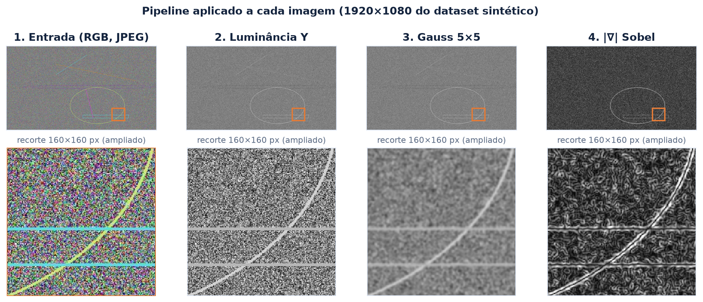
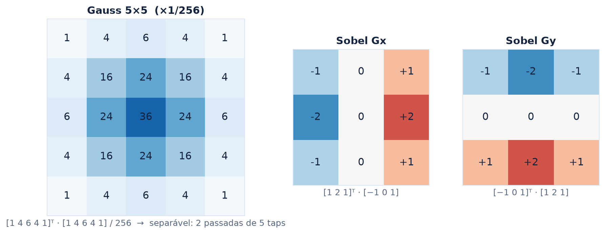
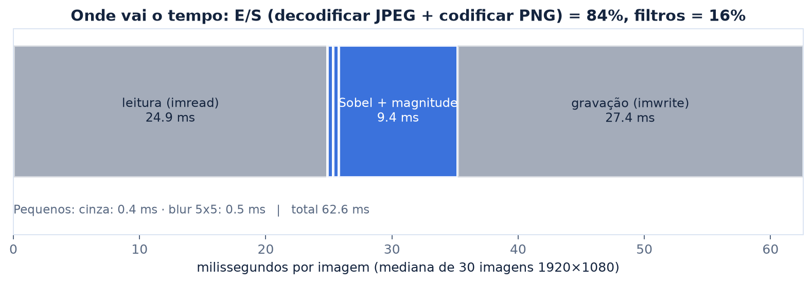
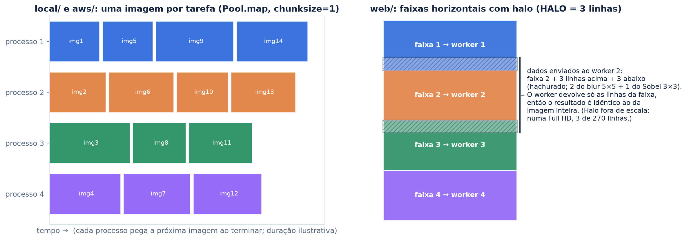
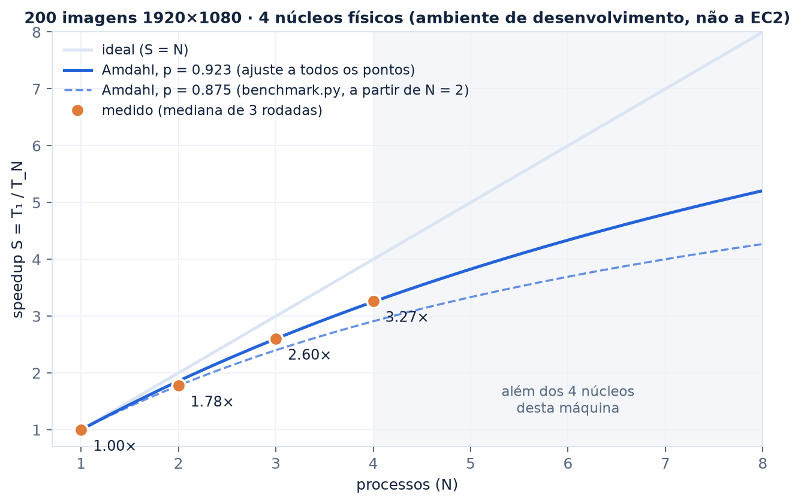
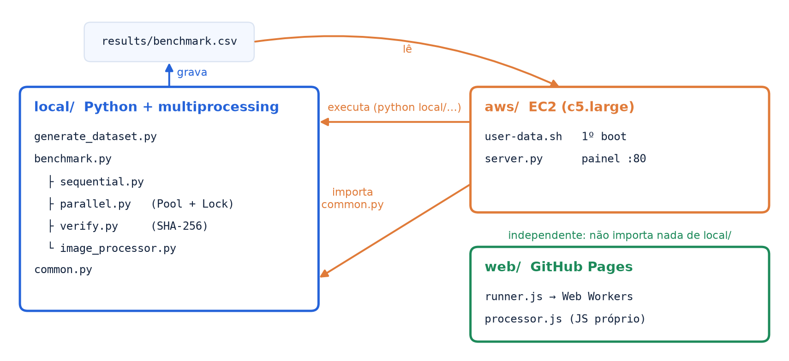

<h1 align="center">
  <picture>
    <source media="(prefers-color-scheme: dark)" srcset="assets/logo/logo-dark.png">
    
  </picture>
</h1>

<p align="center"><b>Filtragem por convolução em lote: decomposição de dados, corretude bit a bit e limites de escalabilidade</b></p>

## Resumo

Este trabalho mede quanto o paralelismo de dados reduz o tempo de um pipeline clássico de
processamento de imagens: conversão para luminância, suavização gaussiana 5×5 e magnitude do
gradiente de Sobel, aplicado a lotes de imagens Full HD (1920×1080). O mesmo operador é executado
de forma sequencial e paralela em três ambientes: CPython com `multiprocessing` (`local/`), a mesma
implementação numa instância AWS EC2 (`aws/`) e uma reimplementação em JavaScript com Web Workers
no navegador (`web/`). A saída paralela é verificada **byte a byte** contra a sequencial. Num
processador de 4 núcleos físicos, o speedup medido foi de **3,27× com 4 processos** (eficiência de
82 %). O perfil por estágio mostra que **84 % do tempo por imagem é E/S de codec** (decodificar JPEG
e codificar PNG), não convolução. Esse resultado muda a leitura do que está sendo paralelizado.

---

## 1. Problema

Filtros lineares locais são o bloco básico da visão computacional e da computação gráfica: anti-aliasing,
pirâmides de imagem, detecção de bordas e realce. Numa imagem de *W×H* pixels, uma convolução com
kernel *k×k* custa O(*W·H·k²*), ou O(*W·H·k*) quando o kernel é separável. Uma imagem Full HD tem
2,07 milhões de pixels. Um lote de 2000 imagens soma cerca de 4,1 bilhões de pixels por passada, e
cada imagem pode ser processada sem depender das outras. Esse é o caso típico de paralelismo de
dados: o custo cresce linearmente com o lote e não há dependência entre tarefas.

## 2. O operador



*Figura 1: uma imagem do dataset sintético em cada estágio. O recorte ampliado mostra o efeito
local: o blur atenua o ruído de alta frequência, e o Sobel responde às transições de intensidade,
com contorno duplo nas linhas de 3 px, uma borda de subida e outra de descida.*

Para cada pixel (as fórmulas são as usadas pelo OpenCV em `local/image_processor.py`):

1. **Luminância** (ITU-R BT.601): *Y = 0,299·R + 0,587·G + 0,114·B*, arredondada para 8 bits.
2. **Suavização gaussiana 5×5**: com `sigmaX=0` e `ksize=5`, o OpenCV usa o kernel binomial
   *g = [1 4 6 4 1]/16*, aplicado nas duas direções (*G = gᵀg*). É a aproximação discreta clássica
   de uma gaussiana com σ ≈ 1,1 e atua como filtro passa-baixa antes da derivada.
3. **Gradiente de Sobel**: *Gₓ = K * I* e *G_y = Kᵀ * I*, com *K = [1 2 1]ᵀ·[−1 0 1]*, calculados em
   ponto flutuante de 64 bits.
4. **Magnitude**: *|∇I| = √(Gₓ² + G_y²)*, saturada em [0, 255] e truncada para `uint8`.



*Figura 2: os três kernels. Todos são separáveis (produto externo de dois vetores), o que reduz o
custo por pixel de k² para 2k multiplicações e somas.*

Contando as operações, o operador tem a ordem de algumas dezenas de operações aritméticas por pixel
(3 da luminância, cerca de 10 do blur separável, cerca de 12 dos dois Sobel e 4 da magnitude). É
uma carga **leve** por byte lido, o que antecipa o resultado da seção 3.

## 3. Onde o tempo é gasto



*Figura 3: tempo mediano por estágio em 30 imagens 1920×1080, com as mesmas chamadas OpenCV
do projeto.*

| Estágio | ms/imagem | Parcela |
|---|---:|---:|
| Leitura (`imread`: decodificação JPEG) | 24,9 | 40 % |
| Luminância | 0,4 | 1 % |
| Gauss 5×5 | 0,5 | 1 % |
| Sobel + magnitude (float64) | 9,4 | 15 % |
| Gravação (`imwrite`: codificação PNG) | 27,4 | 44 % |
| **Total** | **62,6** | |

Duas observações:

- **O gargalo é o codec, não o filtro.** A codificação PNG (compressão *deflate*) e a decodificação
  JPEG (entropia + IDCT) somam 84 %. Os filtros, que são o "processamento de imagem" do ponto de
  vista do experimento, ocupam 16 %. O paralelismo acelera tudo por igual, porque cada processo
  faz as cinco etapas, mas o resultado mede sobretudo a vazão de codecs.
- **A linha de base "sequencial" não é estritamente de uma thread.** O OpenCV paraleliza
  internamente algumas funções. Com `cv2.setNumThreads(1)`, os filtros passam de 10,3 para
  16,6 ms/imagem (Sobel: 9,4 → 14,2 ms). Isso não invalida a comparação, pois as duas versões usam
  a mesma biblioteca e a mesma configuração, mas deve constar como condição experimental.

## 4. Decomposição paralela



*Figura 4: à esquerda, o escalonamento dinâmico de imagens inteiras (`local/`, `aws/`). À direita,
a divisão de cada imagem em faixas com halo (`web/`).*

**Granularidade de imagem (`local/`, `aws/`).** Cada tarefa é uma imagem. `Pool.map` com
`chunksize=1` entrega a próxima imagem ao primeiro processo livre, e esse escalonamento dinâmico
absorve a variação de custo entre imagens. Processos, e não threads, porque o trabalho é limitado
por CPU e o GIL do CPython serializaria o código Python entre as chamadas nativas. A única seção
crítica é o contador de concluídas (`multiprocessing.Value`) e a linha do relatório CSV, protegidos
por um `multiprocessing.Lock` que envolve só o incremento e a escrita.

**Granularidade de faixa (`web/`).** No navegador, cada imagem é cortada em faixas horizontais,
uma por worker, para haver paralelismo mesmo com uma única imagem. Um operador de vizinhança
precisa de contexto além da faixa: o blur 5×5 lê 2 linhas de cada lado, e o Sobel 3×3 lê mais 1
linha sobre o resultado do blur. Por isso cada faixa é enviada com um **halo de 2 + 1 = 3 linhas**
(`HALO = 3` em `web/assets/processor.js`), e o worker devolve só as linhas que lhe pertencem. O
custo extra é de 6 linhas por faixa: numa Full HD com 4 faixas de 270 linhas, cerca de 2 % a mais
de leitura. Não há estado compartilhado. O `ArrayBuffer` da faixa é **transferido** (não copiado)
por `postMessage`, e só a thread principal monta a imagem final, por isso não há lock.

## 5. Corretude

A versão paralela precisa produzir **a mesma saída** que a sequencial, não uma parecida:

- O operador é determinístico e a saída de uma imagem depende apenas dos seus próprios pixels.
- `local/verify.py` compara o SHA-256 de cada PNG das duas execuções. `benchmark.py` repete a
  verificação em todas as rodadas e termina com erro se houver diferença.
- Na web, o teste `tests/web/processor.test.mjs` confirma que a imagem processada em faixas com
  halo é idêntica, pixel a pixel, à processada inteira. A implementação JavaScript segue a do
  OpenCV, mas pode diferir em um nível de arredondamento em alguns pixels. Por isso a comparação
  na web é entre sequencial e paralelo no próprio navegador, nunca contra o OpenCV.

## 6. Resultados



*Figura 5: speedup medido com `local/benchmark.py` (200 imagens 1920×1080, mediana de 3 rodadas
intercaladas), Intel Xeon 2,1 GHz com 4 núcleos físicos e sem SMT. Ambiente de desenvolvimento,
não a instância EC2.*

| Processos (N) | Tempo (s) | Speedup S | Eficiência S/N | Verificado |
|---:|---:|---:|---:|:---:|
| 1 | 15,85 | 1,00× | 100 % | — |
| 2 | 8,91 | 1,78× | 89 % | sim |
| 3 | 6,09 | 2,60× | 87 % | sim |
| 4 | 4,85 | 3,27× | 82 % | sim |

**Lei de Amdahl.** Para *S(N) = 1 / ((1 − p) + p/N)*, o ajuste por mínimos quadrados aos quatro
pontos dá **p ≈ 0,92**, com teto teórico de 1/(1 − p) ≈ 13×. O `benchmark.py` estima *p* só a partir
do menor N (p ≈ 0,875), por isso sua curva prevista subestima os pontos com 3 e 4 processos.

A perda de eficiência com N maior é compatível com as hipóteses abaixo, **não isoladas** neste
experimento:

- **Sobreassinatura de threads:** cada processo mantém o pool interno do OpenCV, então N processos
  × 4 threads disputam 4 núcleos.
- **Banda de memória e cache:** cada imagem movimenta dezenas de MB (BGR 6 MB; cada plano float64
  do Sobel, cerca de 17 MB), muito acima do cache, e os N processos disputam o mesmo barramento.
- **Custo fixo do `Pool`:** criar processos e trocar mensagens por pipe.
- **Disco:** leitura dos JPEG e escrita dos PNG.

**Leitura para a nuvem.** A `c5.large` usada em `aws/` tem 2 vCPU que correspondem a **1 núcleo
físico com 2 threads** (hyperthreading). Os dois processos dividem as mesmas unidades de execução,
então o speedup esperado ali fica bem abaixo dos 1,78× medidos aqui com 2 núcleos reais.

## 7. Arquitetura do repositório



*Figura 6: são duas implementações do operador (`local/` em Python e `web/` em JavaScript). A pasta
`aws/` não tem pipeline próprio: executa e importa o código de `local/` numa instância EC2 e
publica o `results/benchmark.csv` num painel HTTP somente leitura.*

| Pasta | Paralelismo | Unidade de trabalho | Onde roda |
|---|---|---|---|
| `local/` | processos (`multiprocessing`) | imagem | computador local |
| `aws/` | o mesmo de `local/` | imagem | EC2 `c5.large`, preparada por `user-data.sh` |
| `web/` | threads isoladas (Web Workers) | faixa com halo | navegador ([GitHub Pages](https://lianeheidemann.github.io/parallel-image-pipeline/)) |

Para reproduzir a medição:

```bash
pip install -r requirements.txt
python local/generate_dataset.py --count 200 --width 1920 --height 1080
python local/benchmark.py --workers 2 3 4 --repeat 3
```

## 8. Limitações e trabalhos futuros

- **Separar codec de filtro.** Medir o operador sobre imagens já decodificadas em memória isola o
  ganho do paralelismo sobre a convolução, que é o objeto de estudo. O PNG poderia ser gravado
  com compressão menor (`IMWRITE_PNG_COMPRESSION`) ou substituído por um formato bruto.
- **Aritmética.** Calcular o Sobel em `float32` ou `int16` em vez de `float64` reduz pela metade (ou
  mais) o tráfego de memória e dobra a largura efetiva dos registradores SIMD.
- **Fusão e tiles 2D.** Fundir blur e Sobel num único passe sobre tiles que cabem no cache L2 evita
  gravar os planos intermediários. É a mesma ideia de halo da versão web, aplicada ao cache.
- **GPU.** O operador é trivialmente paralelo por pixel. Um *compute shader* (WebGPU) ou um *fragment
  shader* (WebGL 2) tipicamente processaria uma Full HD em menos de um milissegundo, e a transferência
  CPU↔GPU passaria a ser o custo dominante.
- **Controle da linha de base.** Repetir a medição com `cv2.setNumThreads(1)` em todos os processos,
  para que o speedup reflita apenas o `multiprocessing`.
- **Dataset.** As imagens sintéticas são ruído uniforme com formas. O custo dos filtros não depende
  do conteúdo, mas o do codec depende (entropia). Fotografias reais alterariam a parcela de E/S.

## Referências

1. I. Sobel, G. Feldman. *A 3×3 Isotropic Gradient Operator for Image Processing*. Stanford AI
   Project, 1968.
2. R. C. Gonzalez, R. E. Woods. *Digital Image Processing*, 4ª ed. Pearson, 2018. Caps. 3 e 10.
3. G. M. Amdahl. *Validity of the single processor approach to achieving large scale computing
   capabilities*. AFIPS Spring Joint Computer Conference, 1967.
4. ITU-R Recommendation BT.601. *Studio encoding parameters of digital television*.
5. OpenCV. [Image Filtering](https://docs.opencv.org/4.x/d4/d86/group__imgproc__filter.html)
   (`GaussianBlur`, `getGaussianKernel`, `Sobel`).

---

<sub>Figuras geradas a partir do código e do dataset deste repositório. Tempos medidos em 24/09/2026
no ambiente de desenvolvimento descrito na Figura 5. Licença [MIT](LICENSE).</sub>
