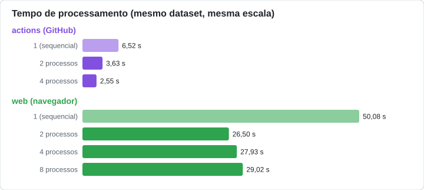
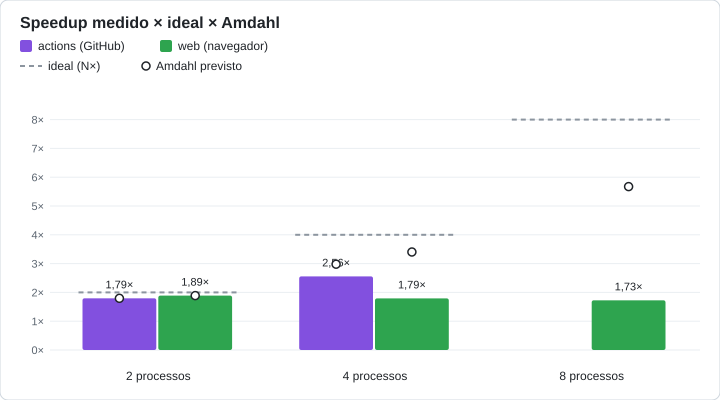

# Comparação de desempenho entre ambientes

Gerado em 29/09/2026 11:47 por `local/compare_environments.py`.
Sem dados ainda: local (PC), aws (EC2).

## Dataset de cada ambiente

- **actions (GitHub)**: 100 imagens 1920x1080
- **web (navegador)**: 100 imagens 1920x1080

Todos os ambientes processaram o mesmo dataset: tempos e *speedup* são comparáveis.

## Tabela

| Ambiente | Processos | Tempo (s) | Speedup | Amdahl previsto | Verificado |
|---|---:|---:|---:|---:|:---:|
| actions (GitHub) | 1 (sequencial) | 6,5206 | 1,0 | 1,0 | — |
| actions (GitHub) | 2 | 3,6334 | 1,795 | 1,795 | sim |
| actions (GitHub) | 4 | 2,5508 | 2,556 | 2,978 | sim |
| web (navegador) | 1 (sequencial) | 50,0793 | 1 | 1 | — |
| web (navegador) | 2 | 26,5046 | 1,889 | 1,889 | sim |
| web (navegador) | 4 | 27,9331 | 1,793 | 3,403 | sim |
| web (navegador) | 8 | 29,0159 | 1,726 | 5,676 | sim |

## Resumo

- **actions (GitHub)**: sequencial 6,52 s; mais rápido em paralelo 2,55 s com 4 processos (speedup 2,56×)
- **web (navegador)**: sequencial 50,08 s; mais rápido em paralelo 26,50 s com 2 processos (speedup 1,89×)

## Gráficos

## Como ler

Mesmo com o mesmo dataset, os ambientes diferem em hardware, na implementação dos filtros (OpenCV em Python, JavaScript na web) e na granularidade da paralelização (uma imagem por processo em Python, faixas horizontais por Web Worker na web). O *speedup* mostra quanto cada ambiente ganha ao paralelizar; os segundos mostram qual é mais rápido — e só valem entre ambientes com o mesmo dataset.
