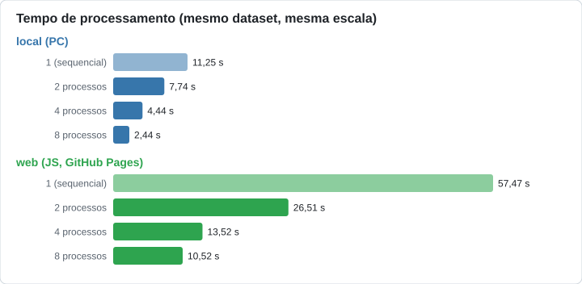
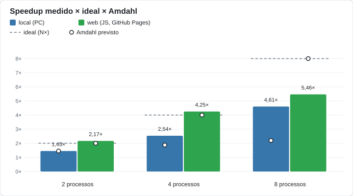

# Comparação de desempenho entre ambientes

Gerado em 29/09/2026 12:00 por `local/compare_environments.py`.
Sem dados ainda: aws (EC2), actions (GitHub).

## Dataset de cada ambiente

- **local (PC)**: 100 imagens 1920x1080
- **web (JS, GitHub Pages)**: 100 imagens 1920x1080

Todos os ambientes processaram o mesmo dataset: tempos e *speedup* são comparáveis.

## Tabela

| Ambiente | Processos | Tempo (s) | Speedup | Amdahl previsto | Verificado |
|---|---:|---:|---:|---:|:---:|
| local (PC) | 1 (sequencial) | 11,2465 | 1,0 | 1,0 | — |
| local (PC) | 2 | 7,7442 | 1,452 | 1,452 | sim |
| local (PC) | 4 | 4,4373 | 2,535 | 1,877 | sim |
| local (PC) | 8 | 2,4424 | 4,605 | 2,198 | sim |
| web (JS, GitHub Pages) | 1 (sequencial) | 57,4687 | 1 | 1 | — |
| web (JS, GitHub Pages) | 2 | 26,5117 | 2,168 | 2 | sim |
| web (JS, GitHub Pages) | 4 | 13,5164 | 4,252 | 4 | sim |
| web (JS, GitHub Pages) | 8 | 10,5152 | 5,465 | 8 | sim |

## Resumo

- **local (PC)**: sequencial 11,25 s; mais rápido em paralelo 2,44 s com 8 processos (speedup 4,61×)
- **web (JS, GitHub Pages)**: sequencial 57,47 s; mais rápido em paralelo 10,52 s com 8 processos (speedup 5,46×)

## Gráficos

## Como ler

Mesmo com o mesmo dataset, os ambientes diferem em hardware, na implementação dos filtros (OpenCV em Python, JavaScript na web) e na granularidade da paralelização (uma imagem por processo em Python, faixas horizontais por Web Worker na web). O *speedup* mostra quanto cada ambiente ganha ao paralelizar; os segundos mostram qual é mais rápido — e só valem entre ambientes com o mesmo dataset.
